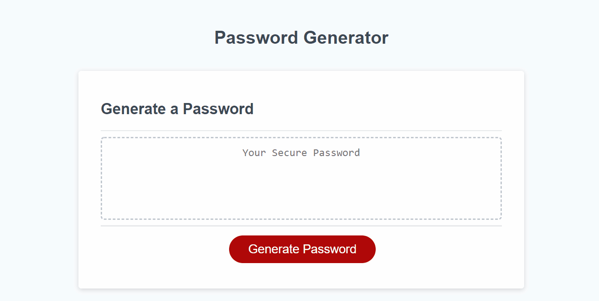

# Password Generator

## About the project

This application will generate a random password between 8 and 128 characters. Base on the user input, the password generated can include uppercase, lowercase, numbers and special character. 

---

## Getting started
Below are the prerequisite understanding and programs that were utilized :
* Visual Studio Code-click [here](https://code.visualstudio.com/) to a tutorial to install
* Github repository-click [here](https://help.github.com/en/github/)

---

## Code spotlight

The code snippet below execute an alert until the user input satisfy our condition.
```js
{
    while (isNaN(passwordLength) || passwordLength < 8 || passwordLength > 128) {

    passwordLength = prompt("Password length: Please choose a number between 8 to 128 ")
    if (isNaN(passwordLength) || passwordLength < 8 || passwordLength > 128) {
      alert("Please enter a number between 8 and 128");
      passwordLength = 0;
      continue;
    }
  };
}
```

---

## Demo




---

## Deployed link

[Live site](https://mtbanh.github.io/password-generator/)
---

## Author

**Mai Banh**
- [Link to Github](https://github.com/mtbanh)
- [Link to LinkedIn](https://www.linkedin.com/in/mai-banh-311ba6164/)

See also the list of [contributors](https://github.com/your/project/contributors) who participated in this project.

## Acknowledgments
Thank you to everyone who have helped out, and especially my mentor, Matthew Chen! 